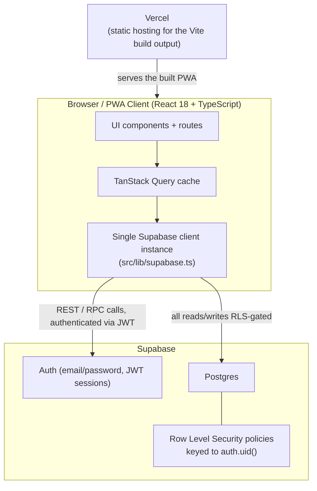
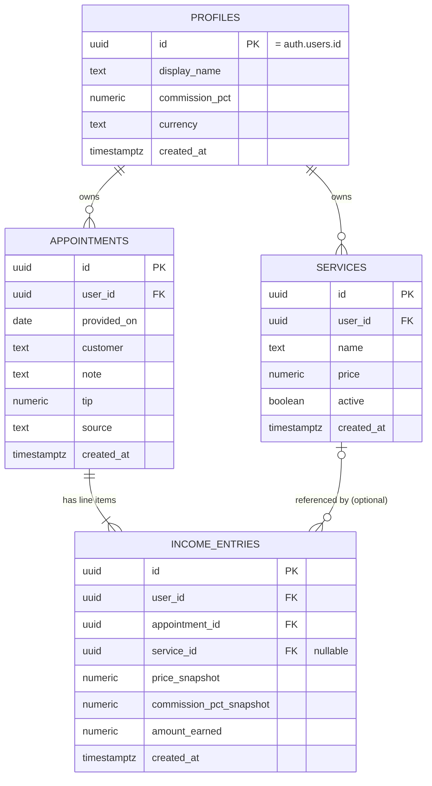
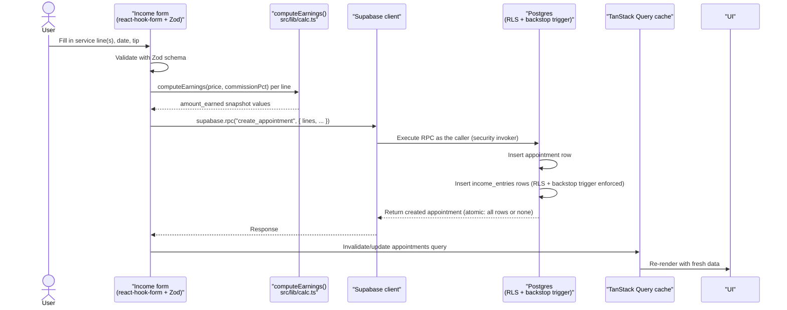

# Service Income Tracker

An installable PWA for freelancers and solo service providers (hairdressers, barbers, and similar) to log income per appointment, apply a commission percentage, and see stats broken down by service. Built as a portfolio project demonstrating a small production-shaped React + Supabase stack.

## Tech Stack

| Layer | Choice |
|---|---|
| Frontend | React 18 + TypeScript + Vite |
| PWA | vite-plugin-pwa (Workbox) — installable, offline-capable |
| Styling | Tailwind CSS |
| Routing | React Router |
| Data fetching | TanStack Query |
| Forms / validation | react-hook-form + Zod |
| Charts | Recharts |
| Backend | Supabase (Postgres + Auth + Row Level Security) |
| Hosting | Vercel (frontend) + Supabase (backend), both on free tiers |

## Architecture



All Supabase access goes through the single client instance in `src/lib/supabase.ts` — nothing else calls `createClient`. Every table has Row Level Security enabled, so every query is scoped to the signed-in user; there is no service-role key in the frontend, and no code path bypasses RLS.

## Data Model



`profiles.id` mirrors `auth.users.id` one-to-one and is created automatically by a signup trigger. `services` and `appointments` belong to a user; each `appointments` row (one customer visit) owns one or more `income_entries` line items, and each line item optionally points at the `services` row it was based on.

**Snapshot invariant:** `price_snapshot`, `commission_pct_snapshot`, and `amount_earned` are captured once, at insert time, via `computeEarnings()` in `src/lib/calc.ts`, and are **never recalculated afterward** — even if the underlying service price or the profile's commission percentage changes later. This is a deliberate historical-accuracy decision: past income entries must keep reflecting the rate that actually applied when the work was done. A Postgres trigger (installed in the schema migration) acts as a backstop, rejecting any insert/update where `amount_earned` doesn't match `price_snapshot × (commission_pct_snapshot / 100)` within a small tolerance — but it only validates, it does not compute, so the app must always call `computeEarnings` explicitly. A per-appointment `tip` is kept separately and is not subject to commission, so it's added on top of earnings (`computeTakeHome`) rather than folded into the snapshot formula.

## Flow: Logging Income



`create_appointment` (and `update_appointment` for edits) run as a single Postgres function so the appointment and all of its line items commit atomically — either everything is saved or nothing is. The RPC never computes `amount_earned` itself; it only stores the value the client already computed and validated.

## Local Setup

Prerequisites: Node 20+, a free [Supabase](https://supabase.com) account, and (for deployment) a free [Vercel](https://vercel.com) account.

1. Clone the repo and install dependencies:
   ```bash
   git clone https://github.com/F1xik/service-tracker.git
   cd service-tracker
   npm install
   ```
2. Create a Supabase project and copy its project URL and anon key from **Project Settings → API**.
3. Copy the env file and fill in both values:
   ```bash
   cp .env.example .env
   ```
   ```
   VITE_SUPABASE_URL=
   VITE_SUPABASE_ANON_KEY=
   ```
4. Apply the database schema: open the single migration file in `supabase/migrations/` in the Supabase SQL editor and run it, or, if you have the Supabase CLI linked to your project, run:
   ```bash
   supabase db push
   ```
5. Start the dev server:
   ```bash
   npm run dev
   ```
   Open [http://localhost:5173](http://localhost:5173).

## Testing

```bash
npm run test
```

Runs the Vitest suite once (`npm run test:watch` for watch mode). CI also runs `npm run lint`, `npm run format:check`, `npm run typecheck`, and `npm run build` — all must pass.

## Building for Production

```bash
npm run build     # tsc -b && vite build
npm run preview   # serve the production build locally
```

## Deploying to Vercel

1. Push the repo to GitHub.
2. Import the repo into Vercel.
3. In the Vercel project's settings, add the two environment variables: `VITE_SUPABASE_URL` and `VITE_SUPABASE_ANON_KEY`.
4. Deploy. Vercel auto-detects the Vite project — no custom build configuration is needed.

## Installing as a PWA

- **iOS (Safari):** open the deployed site, tap the Share button, then "Add to Home Screen."
- **Android (Chrome):** open the deployed site, tap the install prompt (or the browser menu → "Install app").

## Notes for Reviewers

- **RLS is the security boundary, not the frontend.** Every table (`profiles`, `services`, `appointments`, `income_entries`) has Row Level Security enabled with policies keyed to `auth.uid()`. There is exactly one Supabase client instance (`src/lib/supabase.ts`), the service-role key never appears in frontend code, and unauthenticated calls simply return zero rows by policy rather than needing special-cased error handling.
- **The snapshot invariant is an explicit design choice, not an oversight.** `amount_earned` could be computed on read from live `services.price` and `profiles.commission_pct`, but that would rewrite history every time a price or commission changes. Instead it's computed once client-side via `computeEarnings()` and stored, with a DB trigger as a backstop that validates (but does not compute) the value on every write.
- **`src/lib/calc.ts` has zero React imports on purpose.** It's the money-path logic (earnings and take-home calculations) and is fully unit-tested in isolation. Keeping it React-free means it can be reused as-is if the app is later wrapped with Capacitor into a native iOS/Android app — no rewrite of the calculation logic would be needed, only a native shell around the existing Vite build.

## Project Structure

```
src/
  lib/
    supabase.ts          # Supabase client init
    calc.ts              # pure earnings/aggregation functions (no React, unit-testable)
  features/
    auth/                # sign up / sign in / session
    services/            # CRUD list of services
    income/              # log income: pick service -> record entry
    stats/               # charts: total per period, split by service
    settings/            # language + commission settings
  components/ui/          # reusable presentational components
  routes/                 # route definitions / pages
supabase/
  migrations/             # single consolidated schema migration: tables, RLS policies, integrity constraints
```

## Further Reading

- [`docs/plan.md`](docs/plan.md) — tech stack rationale and data model background.
- [`docs/tasks/`](docs/tasks/) — per-feature task files with detailed acceptance criteria.
