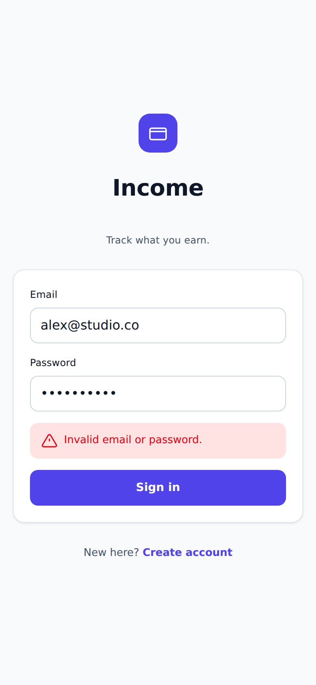
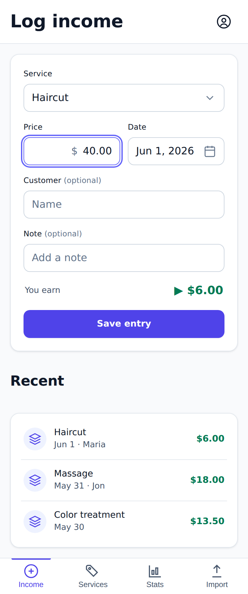
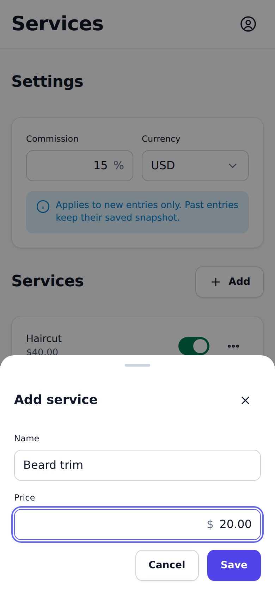
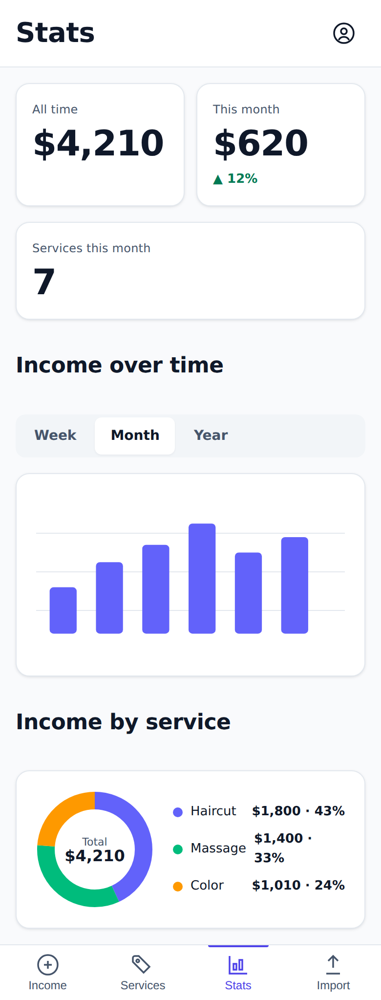

# UI reference mockups

Token-accurate visual references for the screens defined in
[`../design-system.md`](../design-system.md). They exist so implementers (tasks 03–07) have a
picture to build against, not just ASCII wireframes.

> **These are throwaway reference artifacts, not production code.** The durable deliverables are
> the PNGs in [`images/`](./images). The HTML/CSS only exists to render them — the real app
> rebuilds every screen as React components in `src/components/ui/` styled with Tailwind
> utilities + Radix. Do **not** import anything from this folder into `src/`.

## How they stay faithful

`tokens.css` is a **verbatim transcription** of the design system's `@theme` block
([§2.2](../design-system.md#22-color--semantic-tokens-light--dark)) and typography helpers
([§2.4](../design-system.md#24-typography)) — the same OKLCH values the app consumes through
Tailwind v4, just expressed as plain CSS custom properties so the mockups render without a build
step. `components.css` mirrors the component anatomy/states from
[§4](../design-system.md#4-component-library). The design system remains the single source of
truth; if a token changes there, update `tokens.css` and regenerate.

## Screens

Each screen is captured at **mobile (390px)** + **desktop (1280px)**, in **light** + **dark** —
16 PNGs in [`images/`](./images), named `<screen>.<viewport>.<theme>.png`.

| Screen | Spec | Implemented by | Mobile (light) |
|---|---|---|---|
| Sign in / Sign up | [§5.1](../design-system.md#51-sign-in--sign-up) | Task 03 (Auth) |  |
| Log Income (Home) | [§5.2](../design-system.md#52-log-income-home--primary-daily-screen) | Task 05 (Income) |  |
| Services & settings | [§5.3](../design-system.md#53-services--settings) | Task 04 (Services) |  |
| Stats | [§5.4](../design-system.md#54-stats) | Task 06 (Stats) |  |

## Known approximations

- **Charts (Stats):** the app uses **Recharts** ([§4.8](../design-system.md#48-data-visualization-recharts)).
  The bar + donut here are static inline SVG using the `--color-chart-*` palette — accurate to
  the colors and layout, not the live component.
- **Icons:** inline [lucide](https://lucide.dev) SVG markup (`currentColor`, stroke 1.75), copied
  rather than pulled from `lucide-react`, so no runtime dependency is needed.
- **"You earn" value** is a precomputed sample (`computeEarnings(40, 15) = 6.00`); the real screen
  computes it live via `src/lib/calc.ts`.
- **Sticky bars** (tab bar) are pinned statically *in the screenshots only* so
  full-page captures show the whole screen; in a real viewport they dock as specified.

## Regenerating

```bash
npm i -D playwright          # or: npx -y playwright install chromium
node docs/mockups/capture.mjs
```

Writes all 16 PNGs to `images/`. `playwright` is intentionally **not** a project dependency —
install it ad hoc only when regenerating.
